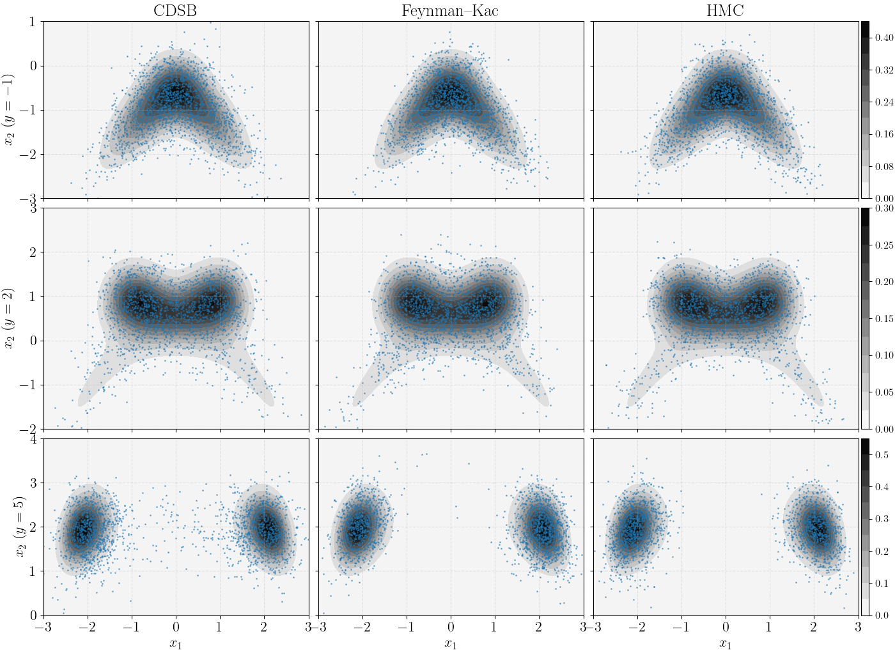

# Pedagogical examples for conditional sampling within generative diffusions

This code repository features some pedagogical examples for conditional sampling within generative diffusions, 
companion with our review paper "Conditional sampling within generative diffusion models". 
In particular, the following methods are illustrated

- Conditional generative sampling with dynamic Schrödinger bridge.
- Conditional generative sampling with Feynman--Kac. 

For details of these methods, please refer to our paper. 



In the figure above, you can see three types of posterior distributions, and approximate samples drawn from CDSB, Feynman--Kac, and HMC. 

# Install

First, git clone this repository, and then set-up your environment by running

```bash
pip install -e .
```

in your venv. Note that if you want to use JAX with GPU, please refer to https://github.com/google/jax?tab=readme-ov-file#installation for the installation guidance.

# How to use
Go to the folder `./demos`. Run `cdsb_samplingl.py` or `feynman_kac_bootstrap.py` to see the results of their perspective methods. 

Running any of the script will generate an `npy` file with the specified condition `y`. Run them with `y = -1`, `y = 2`, and `y = 5`, 
you then will be able to run `plot_paper.py` which exactly reproduce Figures 1 and 2 in our paper. 

## Training
The conditional samplers use Schrödinger bridges. 
To train them, run `dsb_train.py`. 
The folder `./demos/checkpoints` contains the trained models.

# Cite

Please cite us using the following BibTex.

```bibtex
@article{Zhao2024gdcs, 
  title={Conditional sampling within generative diffusion models}, 
  author={Zhao, Zheng and Luo, Ziwei and Sj\"{o}lund, Jens and Sch\"{o}n, Thomas B.}, 
  journal={arXiv preprint arXiv:xxx}, 
  year={2024}
}
```

# License
Apache License 2.0

# Contact
Zheng Zhao (https://zz.zabemon.com) at Linköping University and Uppsala University.
